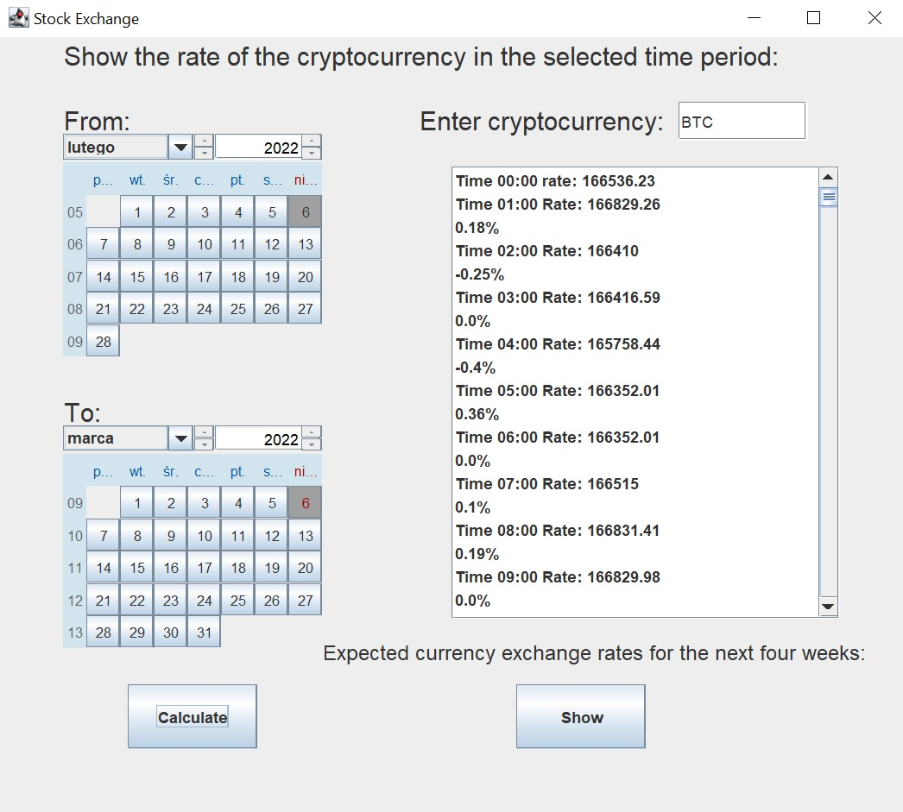
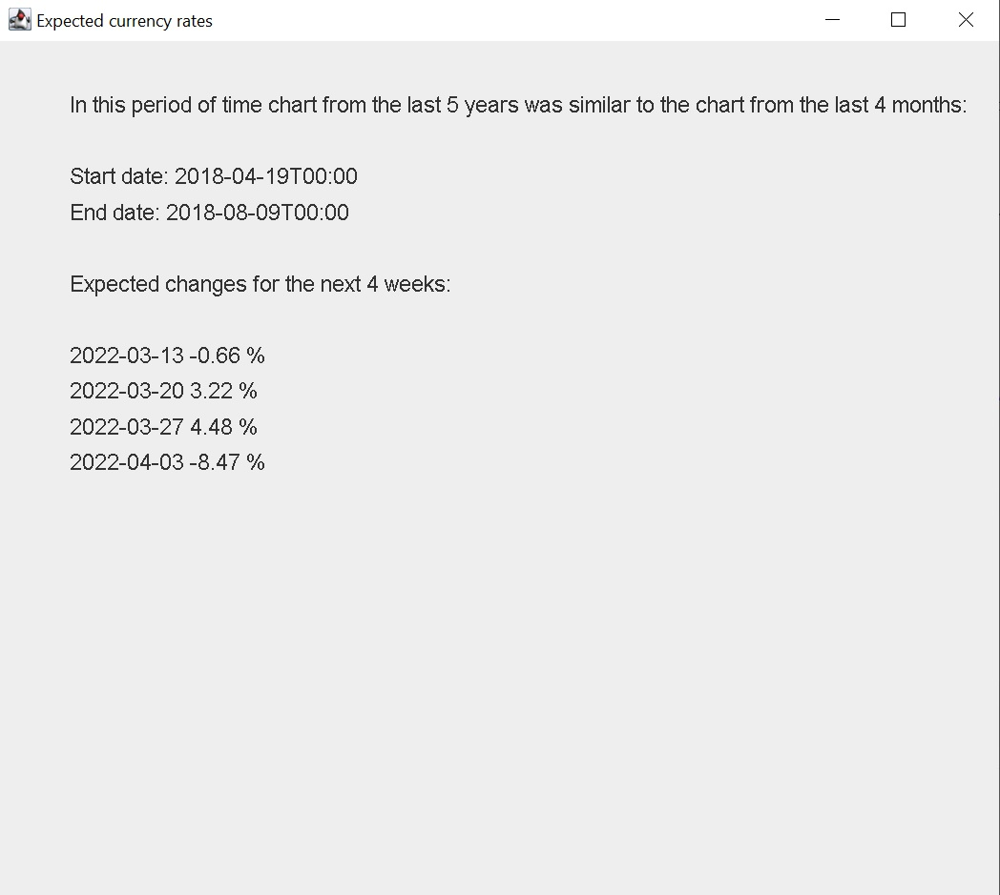

# Stock-Exchange
This program allows you to view the chosen cryptocurrency rate in the selected time period.  
It can also calculate the expected rate for the following four weeks, comparing the rate chart from the last four months to the rate chart from the last five years.  
  
  
## How to use
To clone and run this application, you'll need JDK installed on your computer.  
To view the chosen cryptocurrency rate:
* Choose the time period using calendars: start date and end date
* Enter the name of the chosen cryptocurrency (e.g. BTC)
* Click on "Calculate" button
* The program will display how the rate was changing every hour from the start date to the end date  

To see the expected rate of the cryptocurrency for the next four weeks:
* Enter the name of the chosen cryptocurrency (e.g. BTC)
* Click on "Show" button

The percentages shown in the program are the changes in the cryptocurrency rate comparing to the previous shown value (previous hour or previous week).
## Technologies
* Java 15
